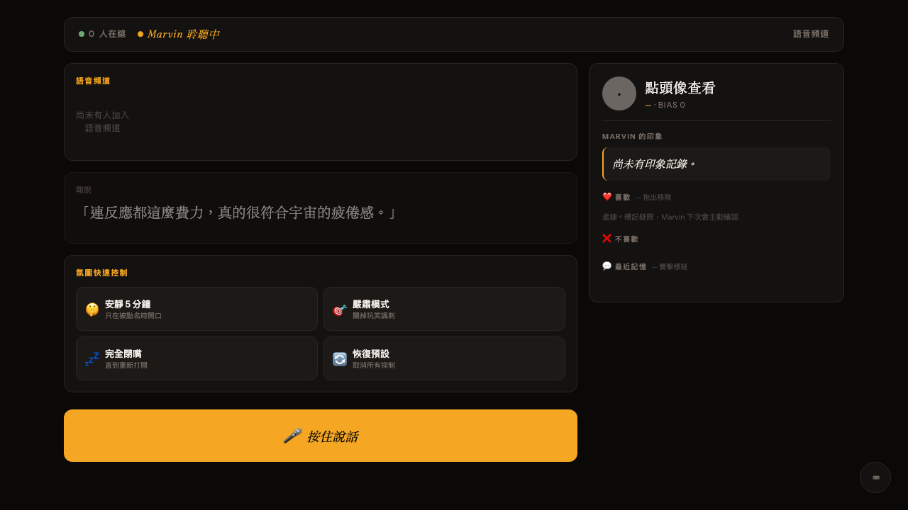

# marvin-voice-companion

**A control surface for [Marvin](https://github.com/butthead0819-beep/marvin-voice-core). What he hears, what he chose, what he's about to say — visible. Correctable. From your phone.**

Marvin lives in your Discord voice channel. Most of the time he reads the room well. Sometimes he doesn't — the words are correct but the timing is wrong, or his memory of you is slightly off, or he's about to make a joke right when the conversation turned serious. This is the companion you open when that happens.

> **macOS host + iOS/Mac browser.** Companion runs on the same machine as Marvin (any OS that runs Marvin). The UI is a web app — open it from Safari on your iPhone via Tailscale, or any browser on the Mac itself.

---

## What this is, in one image



Top: status bar with current voice-channel members. Below: Marvin's most recent utterance with a 5-second feedback window (🤐 太吵 / 🌶️ 太刺 / 😄 太嗨 — three honest signals, no rating scales). Bottom: atmosphere quick controls and a big push-to-talk button. Right: per-person memory panel — drag a fact out to delete, double-click to mark uncertain.

Click any member's bubble: their `suki_memory` profile + recent vector chunks render in the side panel. The bubble itself encodes information without a click — color = relationship stage, pulse = currently speaking, yellow dot = Marvin recently addressed them.

There are also auto-switching modes for music and game sessions. Music mode shows a DJ board with personalized recommendations from `music_memory`. Game mode shows scoreboard + atmosphere gauge + the **防呆雷達** alert card — when Marvin is about to say something the rules-based classifier flags as risky, the alert pops up with **✋ 攔下** / **👍 讓他說** buttons. Two-second timeout, default-safe.

---

## Why this exists

Marvin's previous design doc framed him as a streamer SaaS. That framing turned out to be aspirational — the verified user is the author himself. Companion is built honestly for that audience: a technical operator who runs Marvin daily, occasionally needs to override or correct, and wants the override surface to be **single-thumb on iPhone, zero keyboard**.

Three pain points, three answers:

| Pain | Answer |
|------|--------|
| Marvin misreads atmosphere — words fine, moment wrong | 🤐 / 🌶️ / 😄 feedback that calibrates `AtmosphereTracker` |
| Marvin's memory of someone is wrong | Bubble side panel — drag tag to remove, double-click to mark uncertain (writes to `VectorStore` + `MemoryManager`) |
| You're not at the computer when Marvin's about to be socially awkward | iOS Safari → Tailscale → companion → 防呆雷達 with veto |

---

## How it connects to Marvin

Companion is a **separate process** with **zero business logic**. Every read or write goes through `marvin_voice_core/companion_bridge.py` in the main repo, which directly imports Marvin's `AtmosphereTracker`, `VectorStore`, `MusicMemory`, and `MemoryManager`. When Marvin updates, companion gets the update free — no parallel implementations.

```
iOS Safari / Mac browser
    ↕ WebSocket (Tailscale or localhost)
companion-server (FastAPI, this repo)
    ↕ WebSocket localhost:8766
companion_bridge.py (in marvin-voice-core)
    ↕ direct method calls on shared instances
AtmosphereTracker · VectorStore · MusicMemory · MemoryManager · voice_controller
```

This is **the** design constraint of this project. Companion does not own data, does not duplicate logic, does not crash if Marvin is down (degrades to a disconnected UI banner and retries every 5 seconds).

---

## What you need

- A running [marvin-voice-core](https://github.com/butthead0819-beep/marvin-voice-core) with the `companion_bridge` code (the Marvin commits prefixed `feat(companion): ...`)
- Python 3.12+
- `GROQ_API_KEY` for the push-to-talk voice command path (same key Marvin uses)
- Optional: [Tailscale](https://tailscale.com/) on your Mac + iPhone for remote access

---

## 5-minute quickstart

```bash
# 1. Clone
git clone https://github.com/butthead0819-beep/marvin-voice-companion.git
cd marvin-voice-companion

# 2. Install
pip install -e .

# 3. Configure
cp .env.example .env
# Edit .env — only required field is GROQ_API_KEY (reuse the one from Marvin)

# 4. Run (with Marvin already running on the same host)
uvicorn companion.server:app --port 8080 --host 127.0.0.1

# 5. Open
# Mac: http://localhost:8080
# iPhone via Tailscale: http://<your-mac-tailscale-ip>:8080
```

That's it. Companion auto-discovers Marvin's bridge on `ws://localhost:8766/companion-ws` and reconnects every 5 seconds until it succeeds.

For a UI-only dev session without Marvin running:

```bash
COMPANION_BRIDGE_MOCK=1 uvicorn companion.server:app --port 8080
```

---

## Configuration

All env vars (none are required except `GROQ_API_KEY` for voice commands):

| Variable | Default | Purpose |
|----------|---------|---------|
| `GROQ_API_KEY` | (empty) | Push-to-talk Whisper STT. Without it, voice commands return 503 with a helpful message. |
| `COMPANION_BRIDGE_URL` | `ws://localhost:8766/companion-ws` | Marvin bridge location |
| `COMPANION_BRIDGE_MOCK` | `false` | `1` / `true` skips real bridge — UI dev mode |
| `COMPANION_PORT` | `8080` | (Use uvicorn's `--port` flag, this is informational) |

On the **Marvin side**, the bridge has its own env vars (see marvin-voice-core's README): `COMPANION_BRIDGE_ENABLED`, `COMPANION_BRIDGE_PORT`, `COMPANION_GUILD_ID`, `COMPANION_RADAR_ENABLED`, and the existing `MARMO_TOKEN` (reused for bridge auth).

---

## iOS access via Tailscale

1. Install [Tailscale](https://tailscale.com/) on Mac and iPhone (free tier is sufficient for personal use)
2. Sign both devices into the same Tailscale account
3. On Mac, find your Tailscale IP: `tailscale ip -4` (looks like `100.x.x.x`)
4. On iPhone Safari, open `http://100.x.x.x:8080`
5. Bookmark to home screen for a one-tap launch

iOS Safari has known limitations with `getUserMedia` in the background — the PTT mic works only while Companion is the foreground tab. This is a Web Audio API restriction, not a bug.

---

## Voice commands (push-to-talk)

Hold 🎤, say a command in Chinese or English, release. Companion uploads the audio to Groq Whisper, classifies intent with regex (no LLM — fast, predictable, cheap), and dispatches:

| Phrase shapes | Intent | Action |
|---------------|--------|--------|
| 「閉嘴五分鐘」/ "be quiet" | `mode_silent` | Marvin silent for 5 min unless directly addressed |
| 「嚴肅模式」/ "serious mode" | `mode_serious` | Suppresses jokes and sarcasm |
| 「完全閉嘴」/ "stop talking" | `mode_shutup` | Hard mute until reset |
| 「恢復」/ "resume" | `mode_resume` | Clear all suppression |
| 「太吵」 | `feedback_too_loud` | Atmosphere correction |
| 「太刺」 | `feedback_too_sharp` | Atmosphere correction |
| 「太嗨」 | `feedback_too_jolly` | Atmosphere correction |
| 「跟大家說 X」/ "tell them X" | `tts_inject` | Marvin says X in voice channel |

The recognized text and the action taken are shown in a toast overlay for 3 seconds after release.

---

## 防呆雷達 (don't-be-dumb radar)

Opt-in. On the Marvin side, set `COMPANION_RADAR_ENABLED=true`. When Marvin is about to play TTS in a game-mode session, a rule-based classifier checks for three known risk patterns:

1. Player just lost a round + Marvin's response mentions losing → `defeat_jab`
2. Room is in 嚴肅 / 認真討論 mood + response contains laugh markers → `tone_mismatch_serious_to_joke`
3. Sarcasm aimed at someone with `bias_score < -3` → `sarcasm_to_negative_bias_target`

If risky, Marvin pauses TTS and broadcasts `GAME_ALERT`. Companion shows the alert card with ✋ 攔下 / 👍 讓他說 buttons. Two-second timeout. Default-safe: timeout, disconnect, or any error proceeds with TTS — radar never blocks Marvin permanently.

Rules are intentionally simple. LLM-based classification is a future direction (see roadmap).

---

## Architecture details

The companion-server is intentionally dumb — its only jobs are: serve static files, maintain WebSocket connections, route events. The interesting code is in Marvin's `companion_bridge.py`, which is where event emit hooks meet shared module access.

```
companion/
  server.py              ← FastAPI app + WebSocket hub + /audio endpoint
  bridge_client.py       ← auto-reconnect WS client to Marvin
  event_protocol.py      ← event type constants (single source of truth)
  intent.py              ← regex intent classifier for voice commands
  static/
    index.html           ← idle + music + game modes
    style.css            ← Fraunces + Instrument Sans + amber palette
    app.js               ← WebSocket router, mode auto-switch, state machine
```

Event protocol shape:

```json
{"type": "<event_name>", "payload": {...}, "ts": <unix_seconds>}
```

For the full list of events and their payloads, see [`CLAUDE.md`](CLAUDE.md). Both sides of the bridge use that file as the contract.

---

## Development

```bash
# Run tests
pytest

# Run server in dev mode (auto-reload)
uvicorn companion.server:app --reload --port 8080

# Run with mock bridge (no Marvin needed)
COMPANION_BRIDGE_MOCK=1 uvicorn companion.server:app --reload --port 8080
```

TDD is the project convention — every behavior change starts with a failing test. See `CLAUDE.md` for the full TDD discipline. The current suite is 73 tests, all of which run in under 2 seconds.

Design references are in `docs/mockups/` — these are the original HTML mockups before any implementation existed. They're kept as living references; if you redesign something, update both the mockup and the production HTML.

---

## Roadmap (deferred from v1)

- **LLM-based intent classification** — current regex covers commanding speech well, would help with conversational variations and indirect commands
- **Streaming audio during PTT** — currently single-blob upload on release; chunked streaming would lower latency for long commands
- **VOICE_CHANNEL_SNAPSHOT on-connect push** — framework ready, just needs the bridge to know the current voice channel members
- **iOS native app wrapper** — web works fine via Tailscale; native would enable background mic with VoIP entitlements
- **Multi-Marvin orchestration** — if you ever run Marvin in multiple Discord servers, the companion needs a server selector
- **Streaming audio reactions to music** — currently `MusicMemory.record_reactions` captures who reacted; companion shows it after the fact

---

## Privacy

Companion is a **local-first** project. The only outbound traffic is to Groq's STT endpoint for push-to-talk voice commands, and only when you hold the mic button. Everything else — atmosphere corrections, memory edits, mode changes — stays on your machine.

The data companion reads from Marvin (`suki_memory.json`, vector store, music_memory) is read through Marvin's process via the bridge — companion does not open the data files directly.

---

## Contributing

This is a personal-craft project that happens to be open source. Comments are in Traditional Chinese (zh-TW) — the original Marvin codebase started as a personal bot for a Taiwanese gaming group. English PRs are welcome; translating comments is appreciated but not required.

If you successfully run Companion alongside Marvin on a fresh machine, please open a GitHub Discussions post about your setup. That single confirmation is the most useful signal this project can receive.

---

## License

MIT
